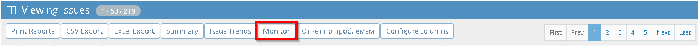
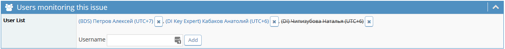
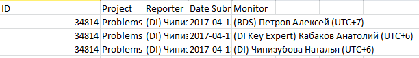

# MonitorsReport

## Overview ##
Mantis plugin: report shows users monitoring issues.
Based on excel_xml_export.php (button "Excel Export").
If a issue is monitored by several users, then a separate line is displayed for each monitor.
Information on monitors is displayed in the additional last column.
Button "Monitor" is added to block "Viewing Issues".

## Screenshots ##

## Info ##
- Requires MantisBT >2.0.0
- Multi language support

## Download ##
[Current version 1.0](https://github.com/AnatolyKabakov1983/MonitorsReport/releases/download/1.0/MonitorsReport-v1.0.zip)

## Installation ##
Copy the "`MonitorsReport`" folder in your plugin directory and open the plugin management page in your Mantis installation.
Click "Install" to complete the installation.

## Configuration ##
Nothing to configure.

## License ##
Released under the terms of the GNU General Public License v3 (GPLv3).

## Support ##
 * Any feedback is greatly appreciated!
